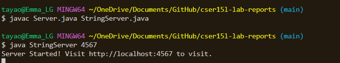
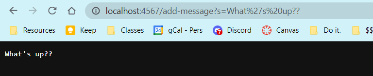
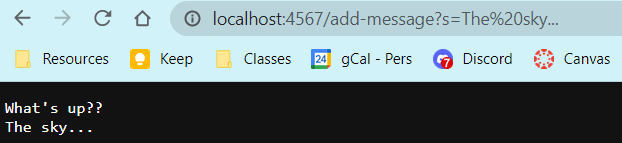
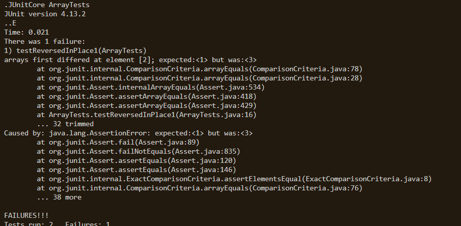

# Lab Report 2 - Servers and Bugs

## Part 1 
StringServer Code:

```ruby
import java.io.IOException;
import java.net.URI;

class Handler implements URLHandler {
    String printOut = "";

    public String handleRequest(URI url) {
        if (url.getPath().equals("/")) {
            return String.format(printOut);
        } else if (url.getPath().equals("/add-message")) {
            System.out.println("Path: " + url.getPath());
            String[] parameters = url.getQuery().split("=");
            if (parameters[0].equals("s")) {
                printOut = printOut + parameters[1] + "\n";
                return printOut;
            }
            else{
                return "404 Not Found! Query invalid";
            }
        }
        return "404 Not Found!";
        
    }
}

class StringServer{
    public static void main(String[] args) throws IOException{
        if (args.length == 0){
            System.out.println("Missing port number bro. Try a number between 1024 and 49151");
            return;
        }
        int port = Integer.parseInt(args[0]);
        Server.start(port, new Handler());

    }
}
```


Once the server is started with `Server.start(<port>, <handler>)` within in the `main` method of *StringServer*. Once you compile and run (see below for example) can now access the server with your specified port.



Here is the terminal commands that started the server I'm going to load the specified url with `/add-message`:

**/add-message?s=What's up??**



##### Methods called & relevant arguments
In this screenshot, the path is `/add-message`. After such is `?` and the query `s=What's up??`. 

Once the `main` method *StringServer* has been run when the command in the terminal began called for *StringServer*, the path is recognized through the `handleRequest` method. This method is called each time the specified url is laoded, or *requested*, into my browser. This is what goes into the `url` parameter. Here, my argument is `http://localhost:4567/add-message?s=What's up??`.

##### Relevant fields
Because this request has both a valid path and qeury, the printOut field is updated to contain the second half of query (i.e. `What's up??`). printOut then becomes `"What's up??\n"`.

Additionally with the `handleRequest` method itself, the `parameters` field becomes `{"s", "What's up??"}`, which refers to the query of the URL.


*Note: the url in the screenshots show added on numbers and symbols (i.e. "%20"). You can ignore this because once the url loads, it replaces the symbols with these % symbols to encode special chraracters.*-


And after adding another line, this is what the page looks like:

**/add-message?s=The sky...**



##### Methods called & relevant arguments
In this screenshot, the path is `/add-message`, as recognized by the `.getPath()` method. After such is `?` and the query `s=The sky...??`, which is recognized by the ``.

Once again, after the `main` method of *StringServer*, the path is run through the `handleRequest` method. This method is called because another url is requested through my browser. 

The argument `http://localhost:4567/add-message?s=The sky...` goes into the `url` parameter of `handleRequest(<url>)`. 
##### Relevant fields
Again, because this request has both a valid path and qeury, the printOut field is updated. Now it contains both `What's up??` and `The sky...` on different lines. printOut is now `"What's up??\nThe Sky...\n"`.

Within the `handlerRequest` method, the `parameters` updates to the split qeury, becoming `{"s", "The sky..."}`.

## Part 2
For this part, I'm going to choose a bug from the `reversedInPlace` method of *ArrayExamples.java* from lab 3.

Here is the original code:
```ruby
static void reverseInPlace(int[] arr) {
    for(int i = 0; i < arr.length; i += 1) {
      arr[i] = arr[arr.length - i - 1];
    }
}
```

##### Failure-inducing input
For the code above, the failure inducing input would be `{ 1,2,3 }`
As a JUnite test, this would look like:
```ruby
  @Test
  public void testReversedInPlace1(){
    int[] input = { 1,2,3 };
    ArrayExamples.reverseInPlace(input);
    assertArrayEquals( new int[]{ 3,2,1 }, input);
  }
  ```
##### Input that doesn't induce failure
For the code above, an input that doesn't induce failure would be `{ 9 }`.
As a JUnit test, this would look like:
```ruby
@Test
public void testReverseInPlace2() {
    int[] input = { 9 };
    ArrayExamples.reverseInPlace(input);
    assertArrayEquals(new int[]{ 9 }, input);
	}
```
##### Symptom from tests
Running JUnit:


As you can see, 2 tests were done (`testReversedInPlace1` and `testReverseInPlace2`), and testReversedInPlace1, the test with the failure inducing input, has failed.  


##### The bug
The bug in the code had been the for-loop that interated through `arr`. 
###### Before:
```ruby
static void reverseInPlace(int[] arr) {
    for(int i = 0; i < arr.length; i += 1) {
      arr[i] = arr[arr.length - i - 1];
    }
}
```
In this first version, the method runs through the entire list and replaces each element with the element on the opposing side. The problem with this is that once the code reaches the halfway mark of the any arr greater than 1, it replaces the second half of the array with the updated first half of the arr, which had already been changed. 

As seen previously, this causes a failure at index 2 of the JUnit test, the last element of the array.
###### After:
```ruby
static void reverseInPlace(int[] arr) {
    int temp;
        for(int i = 0; i < arr.length/2; i += 1) {
        temp = arr[i];
        arr[i] = arr[arr.length - i - 1];
        arr[arr.length - i - 1] = temp;
        } 
}
```
The values in the for loop had been updated and another line had been added to ensure that 2 elements could actually switch values, instead of arr[i] getting assigned a value. 
##### How the issue was fixed
The issue was fixed by changing how the for-loop iterated through the array. Instead of going throuh all of it, it would go through half (or one less than half) of the size of the array. 

This allows elements after the midpoint to be swtiched with the first half of elements. This can be seen between the interaction of  `temp`, `arr[i]`, and `arr[arr.length - i - 1]`. `temp` is used to save the value of `arr[i]` so that it can be assigned to `arr[arr.length - i - 1]` (the opposite element).


## Part 3
In week 2, I learned how to host and run a server. This had always been a mystery to me, as I wondered how and why the URLs I visited every so often even worked. I had heard of this concept of "servers" but never saw it in action. Seeing how servers were hosted from different computers, like my own or in the CSE basement showed me how I websites are created in the first place (or at least running and operating).