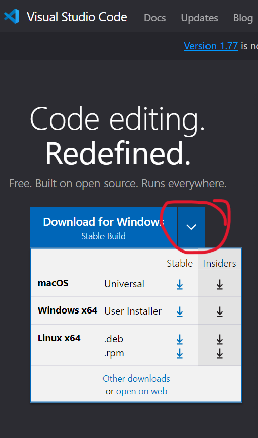
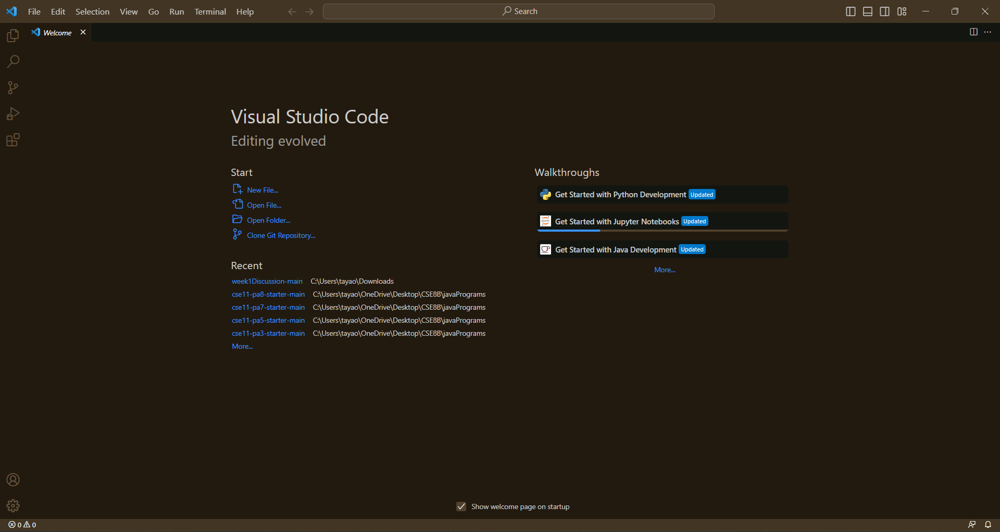
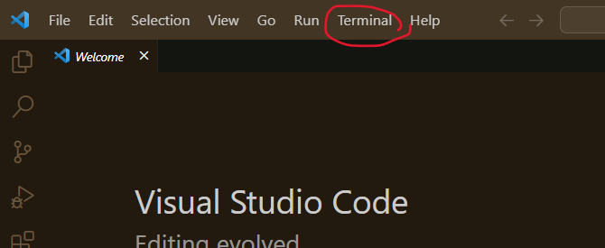
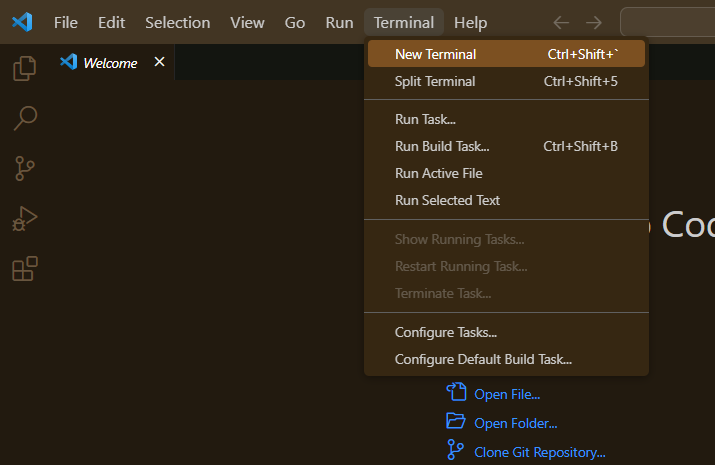
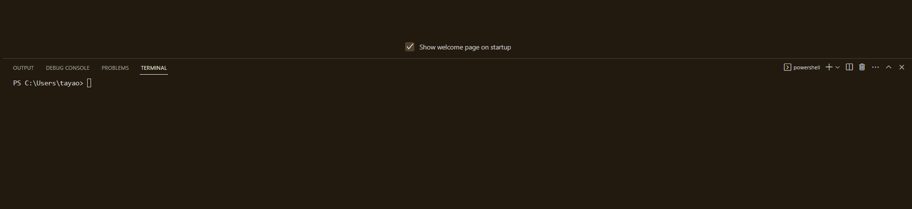
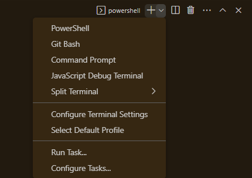
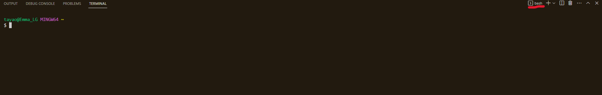
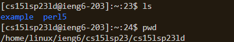
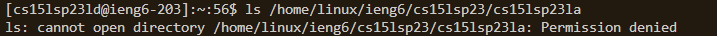

# How to log onto your 15L account!
For this course, you have a course-specific account which can allow you to connect to the CSE basement servers.
This tutorial will show you how to log into that account on *ieng6*

## Step 1 - Starting With Visual Studio Code
Visual Studio (VS) Code is a code editor but also a way for you to access your own terminal. This terminal is where you can run commands and access the CSE basement server later on. 

Open the [VS Code website](https://code.visualstudio.com/), and download and install. Use dropdown menu in the download button to find the correct version according to your operating system (e.g. Windows for PCs, macOS for Macs, etc.).



Once VS Code is installed, opening up VS Code should like like this. My editor may have a different color theme installed than what appears on your computer.



NOTE: Adding this program to your taskbar or desktop will help accessing it in the future.


## Step 2 - Opening The Terminal

Once VS Code is open, go to the top left menu (you might have to open a 3-bar icon to see these options) and click Terminal. You want to select "New Terminal" and a new terminal should appear somewhere on the VS Code application.






FOR WINDOWS USERS: 
The Windows terminal doesn't automatically run bash (Mac automatically does), so you're terminal will look something like this.



If you don't already have Git installed, you to follow this guide need to install [Git For Windows](https://gitforwindows.org/). 
Once you open the terminal and you have Git installed, you need to open this drop-down menu and select "Git Bash".



Then, you can continue on as normal.


Once a new terminal is created, it should look something like this.


   

## Step 3 - Remotely Connecting
 
In the terminal, type in this command
`$ ssh cs15lsp23zz@ieng6.ucsd.edu`

NOTE: You don't need to type in the dollar sign, but replace the zz with your the last 2 letters of your own course-specific username.
 ```
 $ ssh cs15lsp23zz@ieng6.ucsd.edu
 The authenticity of host 'ieng6.ucsd.edu (128.54.70.227)' can't be established.
 RSA key fingerprint is SHA256:ksruYwhnYH+sySHnHAtLUHngrPEyZTDl/1x99wUQcec.
 Are you sure you want to continue connecting (yes/no/[fingerprint])? 
 In return, you should see something like this pop up in the terminal. 
 ```

Type in "yes" and you're connected!

```
-------------------------------------------------------

Hello cs15lsp23zz, you are currently logged into ieng6-203.ucsd.edu

You are using 0% CPU on this system

Cluster Status 
Hostname     Time    #Users  Load  Averages  
ieng6-201   11:30:01   9   0.20,  0.25,  0.21
ieng6-202   11:30:01   10  3.24,  3.16,  3.14
ieng6-203   11:30:01   8   0.23,  0.34,  0.25


Mon Apr 10, 2023 11:33am - Prepping cs15lsp23
[cs15lsp23zz@ieng6-203]:~:23$

```

From here you can try some commands. Here's an example of how the commands look on your terminal.


Examples for `ls` and `pwd`




Examples for `ls -lat`


Examples for trying to access a director for another account 

(You should be denied access)


And you've sucessfully logged in with your CSE 15L account!
