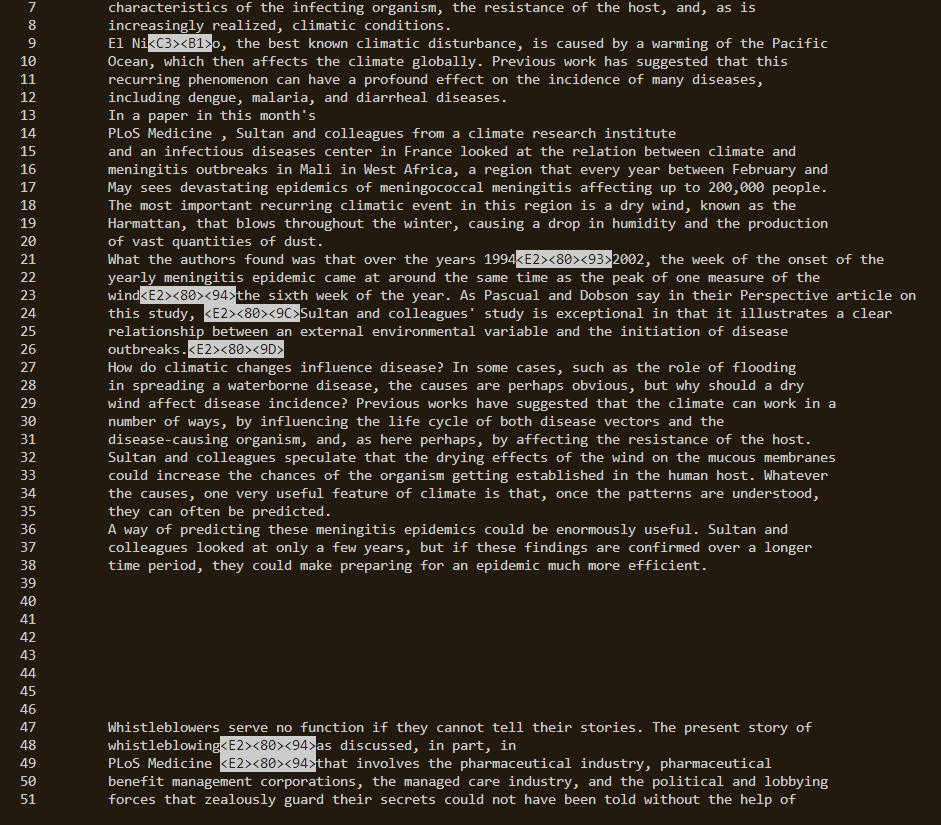

# Lab Report 3 

## Researching Commands
*All examples will be taken from the ./technical directory as descriped in Lab 3. Assume that the working directory is in */technical/*

### The less command

`less` is a command that shows the file's contents, accessing it page by page if it is a longer amound of text. And instead of showing up on the command line like echo, it takes you to a separate page that you can then quit out of and return back to the command line without a big chunk of text in your terminal. 

*As seen here*


Generally, the syntax of the less command looks something like this:
```
less <file path>
```
In return, the less command opens the file's contents. To read large files, you can use the `Up/Down arrow` to go up down, `f` to read more of a file, and `b` to go back in a file. To quit, press `q`.


#### Alternate uses
With different flags (options/versions) of the less command, it would look more like this: `less [options] <file path>`. Each option gives different versions of the `less` command. 

Here's 4.


## -N Flag
The `-N` option displays the line numbers alond with the contents in the file. 

**Example 1: Viewing a specific file** 

Input:
```
ls -N plos/pmed.0020212.txt
```
Output:
```
      1
      2
      3
      4
      5
      6         As a neurologist subspecializing in epilepsy at a respected academic institution, I (DH)
      7         assumed that I knew everything I needed to know about epilepsy and patients with epilepsy.
      8         I was wrong.
      9         In September of 1994, John Lester, my colleague in the Department of Neurology at
     10         Massachusetts General Hospital, showed me an online bulletin board for neurology patients
     11         that he had created [1]. In reading through the online messages, I observed hundreds of
     12         patients with neurological diseases sharing their experiences and discussing their problems
     13         with one another.
     14         I knew that many patients with chronic diseases had been making use of online medical
     15         information [2]. Nonetheless, I was shocked, fascinated, and more than a bit confused by
     16         what I saw. I'd been trained in the old medical school style: my instructors had insisted
```

Here, `less` is printing out the correpsonding number for each line. This is useful because using `less` on large files may be overwhelming and hard to read but using the -N flag allows the file to be even more readable.

**Example 2: cat and less**
Input:
```
cat plos/pmed.0020024.txt plos/pmed.0020281.txt | less -N
```
Output:



*The example is cut off for space purposes, but this picture shoes the concatetation of both file contents*

Here, `cat` is putting together the contents of both files. You can have more than one file used with grep, but here's 2 for space's sake. In addition with `less -N`, cat's readability is improved. The files are put together in the `less` reading space and lines are numbered as well. This is useful for viewing multiple files at a time, while keeping track of where you're reading, hence the line numbers. 


*Sources: [linuxize](https://linuxize.com/post/less-command-in-linux/), [makeuseof](https://www.makeuseof.com/use-less-more-and-most-linux-commands/#:~:text=Using%20the%20Default%20less%20Command&text=To%20move%20forward%20by%20a,want%20to%20go%20back%20by.), [phoenixap](https://phoenixnap.com/kb/less-command-in-linux), ChatGPT*
# -p Flag
The `-p` option specified a search pattern to look for while opening one or more files. The pattern specified is highlighted and directly shows you the first occurance of that pattern.

**Example 1: patterns in one file**

Input:
```
less -p "journalists" plos/journal.pbio.0020228.txt
```
Output:
```
...
policy makers, //journalists//, and other interested parties. Precisely which uses are
        permitted and which are not is far from a trivial matter. The particular copyright license
        under which an article is published largely determines how the document can be stored,
        searched, and built upon by other scientists...

```
*The //journalists// represents how the first instance of "journalists" is highlighted and less directly shows where it is located. In the command line, "journalists" would simply be highlighted. The slashes (//) are added for emphasis. The ... are addded to conserve space.*


**Example 2: patterns in multiple files**


