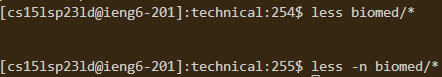

# Lab Report 3 

## Researching Commands
*All examples will be taken from the ./technical directory as descriped in Lab 3. Assume that the working directory is in */technical/*

### The less command

`less` is a command that shows the file's contents, accessing it page by page if it is a longer amound of text. And instead of showing up on the command line like echo, it takes you to a separate page that you can `q` (quit) out of and return back to the command line without a big chunk of text.
*As seen here*


Generally, the syntax of the less command looks something like this:
`less  <file path>`
For example, using `less biomed/rr74.txt` prints out the entire text in rr74.txt.

#### Alternate uses
With different flags (options/versions) of the less command, it would look more like this: `less [options] <file path>`. Each option gives difflesserent versions of the `less` command. Here's 4.


###### -N
The -N option displays the line numbers alond with the contents in the file. 

**Example 1: Viewing a specific file** 
Input:
```
ls -N plos/pmed.0020212.txt
```
Output:
```ruby
c
```
**Example 1: Viewing files in a directory** 
Input:
```
ls -N biomed/*
```
Output:


###### --chop-long-lines

