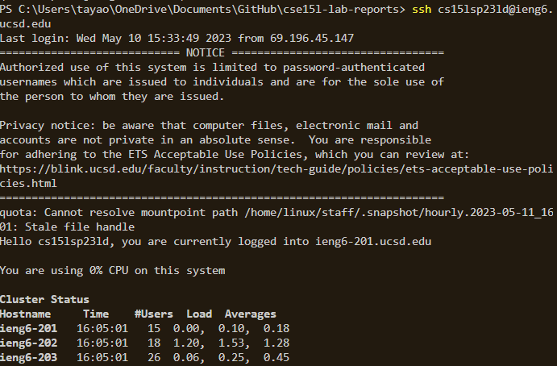
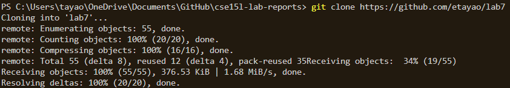
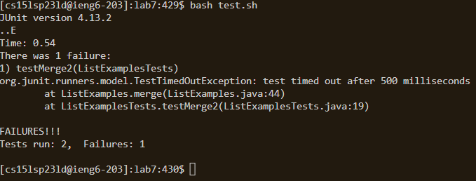
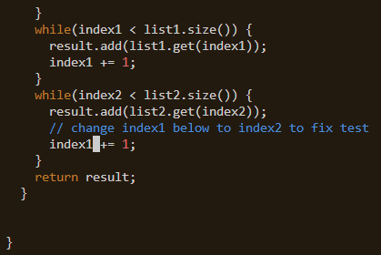
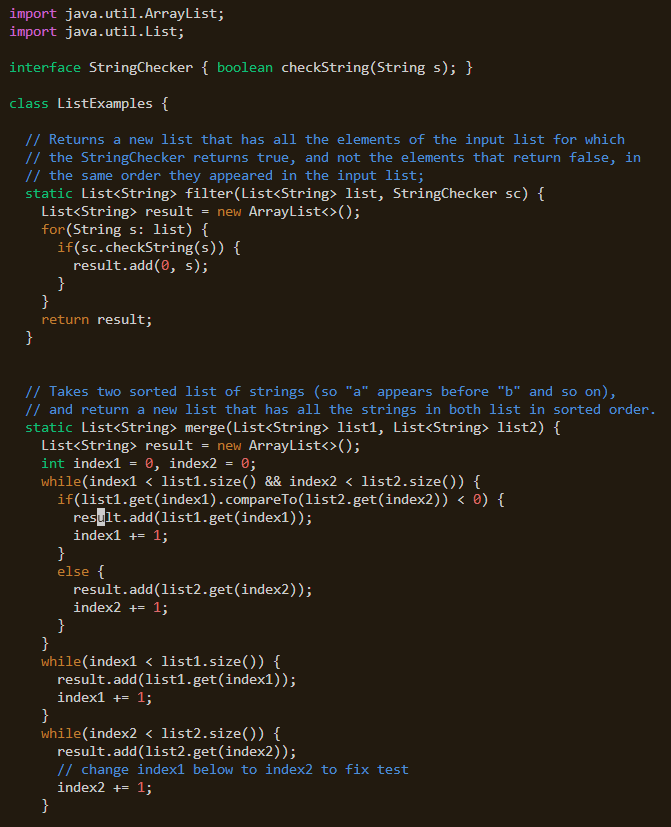
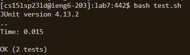
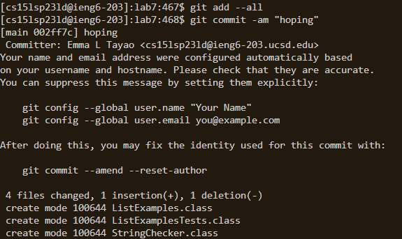
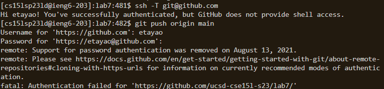
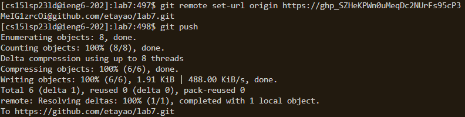

# Lab Report 4

--> skipping steps 1 - 4 (setting up github and starting timer)

At this point, the repo link of my fork is in my clipboard from copying the url with (<ctrl> + <c>)

*Anytime you see <...> with these angle brackets, this means the text inside will refer to certain keys that are pressed. If a referral to what's been type is not in <> brackets, then it is typed out as seen.*
### Step 4 - Logging into ieng6
**What I typed:**

1. Opening terminal: ``<ctrl><`>``

2. Logging in with ssh: (in terminal) `ssh cs15lsp23ld@ieng6.ucsd.edu<enter>`

Since I've already authenticated my laptop in lab7, I don't need to type in a password.

[ ]: #

### Step 5 - Cloning our fork
**What I typed:**

1. Cloning fork: (in terminal) `git clone <ctrl><c><enter>`

This uses the `git clone` command to copy the fork into your directory. [This](https://github.com/ucsd-cse15l-s23/lab7) is the link in my clipboard that is cloned.

### Step 6 - Demonstrating failure
**What I typed:**

1. Changing into lab7 directory: (in terminal) `cd l<tab><enter>`

2. Running the test file: (in terminal) `bash t<tab><enter>`

In order to demonstrate failure, I have to run the test bash file that contains the compile and run Java commands (`javac -cp .:lib/hamcrest-core-1.3.jar:lib/junit-4.13.2.jar *.java` and `java -cp .:lib/hamcrest-core-1.3.jar:lib/junit-4.13.2.jar org.junit.runner.JUnitCore ListExamplesTests`)

### Step 7 - Editing the code
**What I typed:**

1. Open vim: (in terminal) `vim Li<tab>.java<enter>`

    

2. Editing the code: (in vim) `<left arrow><r><2>` (I had only typed 3 times because vim opened my cursor close to my target)

This is what vim looks like on my end:

But here's the entirety of what vim would look like in my terminal if I expanded how big it is in VS Code:

[]: #

3. Escaping insert mode, saving, and quitting vim: (in cim) `<escape><:><w><q>`

To edit my code and make the tests run sucessfully, I need to use vim to change `index1` to `index2`. Thankfully, opening vim on my end lands my right next to the character I'm supposed to change, so that makes it simple for me, otherwise, I would have had to maneuver around the file more.

### Step 8 - Running sucessful tests
**What I typed:**

1. Running the test file: (in terminal) `<up arrow><up arrow>` (because `bash test.sh` was run recently)

After editing the code in vim, the test file has to be run again to show that ListExamples.java has been fixed. Now, there are no errors in the tests.

### Step 9 - Committing and pushing changes to Github
**What I typed:**

1. git add & commit: (in terminal) `git add --all<enter>git commit -am "hoping"<enter>`

2. git push: (in terminal) `git push<enter>`

At first this very last step doesn't work on my end, but after a lot of digging on stack exchange and the GitHub personal access tokens, I was able to get `git push` to work !

Here's git push doing its thing! And me completing my lab report !

