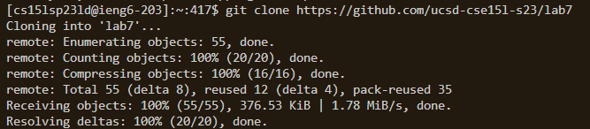

# Lab Report 4

--> skipping steps 1 - 4 (setting up github and starting timer)

*At this point, the repo link of my fork is in my clipboard from copying the url with (<ctrl> + <c>)*
### Step 4 - Logging into ieng6
**What I typed:**

### Step 5 - Cloning our fork
**What I typed:**
Opening terminal: ``<ctrl><\`>``

Cloning fork: `git clone <ctrl><c><enter>`
This uses the `git clone` command to copy the fork into your repository.

*--> Anytime you see <...> with these angle brackets, this means the text inside will be certain keys that are pressed*

### Step 6 - Demonstrating failure
**What I typed:**

### Step 7 - Editing the code
**What I typed:**

### Step 8 - Running sucessfull tests
**What I typed:**

### Step 9 - Committing and pushing changes to Github
**What I typed:**
