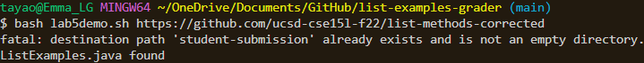
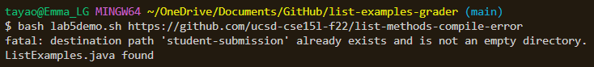
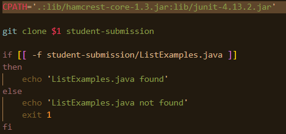
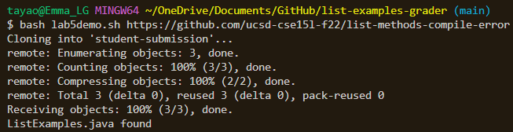

# Lab Report 5

### Part 1 - Debugging Scenario (mimicking EdStem)

##### Debugging Post 
**What environment are you using (computer, operating system, web browser, terminal/editor, and so on)?**

LG Laptop, Windows 11, Chrome, VS Code

**Detail the symptom you're seeing. Be specific; include both what you're seeing and what you expected to see instead. Screenshots are great, copy-pasted terminal output is also great. Avoid saying “it doesn't work”.**

I'm trying to find ListExamples.java in a repo by copying it into my own directory but I get this error message. I was able to find the correct file in the repo, but I get this error message about the directory.

**Detail the failure-inducing input and context. That might mean any or all of the command you're running, a test case, command-line arguments, working directory, even the last few commands you ran. Do your best to provide as much context as you can.**

Any link I put into the command line gives me this same error, as seen in the screenshots above. They both result in this error. 

This is my current code.

It's not pictured here, but student-submissions is already a directory in my repo. 

##### TA Response

If you want to be able to clone the file to a new directory each time, how can you make sure that the files from the repo your cloning into submissions are the only things in student-submissions? You don't want to have copies of the files from past repos you've cloned.

##### Student Retry

I tried removing the directory with the rm command and -rf flag and it worked! I used the rm flag to remove the directory nd the -rf flag to remove the files in the directory to make it empty before I cloned anything into it.

Here's my file now.

